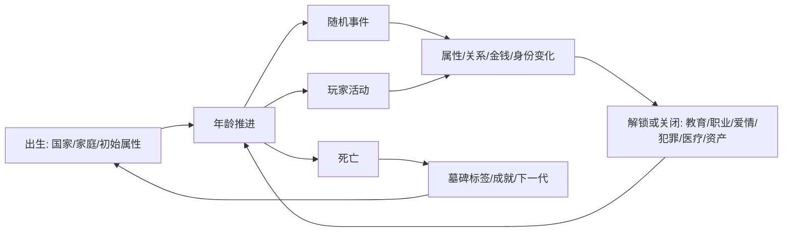

# BitLife 功能矩阵 v0.1

资料源：本项目本地下载的 BitLife Wiki 研究副本，入口见 `/Users/peng/Documents/Project/bitlife/data/wiki_reference/index.json` 和 `/Users/peng/Documents/Project/bitlife/data/wiki_reference/index.csv`。本矩阵用于拆解同类机制和设计参考，不建议直接复制原游戏文本、事件文案、品牌名、挑战名或独有表达。

## 优先级说明

- P0：人生模拟器核心闭环，第一版必须有。
- P1：显著增加可玩性和复玩价值，适合第一版后半或第二版。
- P2：内容量大或系统依赖多，适合扩展包式迭代。

## 功能矩阵

| 模块 | Wiki 参考页 | 核心体验 | 玩家动作 | 关键状态/数据 | 触发与门槛 | 随机后果 | 复刻设计要点 | 优先级 |
|---|---|---|---|---|---|---|---|---|
| 年龄推进 | Age | 每点一次推进一年，产生人生阶段变化和随机事件 | 年龄+、新人生、切换下一代 | 年龄、阶段、出生地、家庭、当前身份、人生日志 | 每回合触发；死亡后转入新人生 | 死亡、怀孕、亲属变动、遭遇事件、疾病、事故 | 这是整个游戏的时钟。所有系统都应挂在 `onAgeUp` 事件上 | P0 |
| 基础属性 | Stats | 用少量数值概括角色状态，并让所有选择影响这些数值 | 读书、锻炼、冥想、看医生、社交、犯罪、整形等 | 快乐、健康、智力、颜值；后期可加名声、声望、公众支持 | 出生随机；每年自然浮动；活动修改 | 低属性警告、疾病、拒绝、死亡、职业机会变化 | 属性要少但高频使用。每个活动至少影响 1-2 个属性 | P0 |
| 出生与家庭 | Relationships / Death/Family | 一出生就有父母、兄弟姐妹、出生国家和家庭资源 | 与亲属互动、要钱、送礼、陪伴、争吵、断联 | 亲属关系值、父母财富、慷慨、宗教、兄弟姐妹性格 | 出生生成；父母可再婚/生育/死亡 | 继父母、半血缘、遗产、家庭冲突、亲属死亡 | 家庭不是背景板，要作为早期资源和事件来源 | P0 |
| 关系系统 | Relationships | 亲人、恋人、前任、朋友、同学、同事都可成为事件对象 | 交谈、称赞、送礼、约会、求婚、分手、复合、跟踪、派对 | 关系值、身份标签、年龄、性格、财富、外貌、忠诚等 | 年龄、关系值、法律、身份限制 | 拒绝、吵架、背叛、限制令、怀孕、死亡、继承 | 用统一 `Person` 模型承载不同关系，不要为每类关系写散逻辑 | P0 |
| 教育 | Education | 从小学到大学/研究生，决定职业门槛和智力成长 | 努力学习、辍学、申请学校、选择专业、加入社团 | 学历、专业、成绩、学校阶段、社团、人脉 | 国家决定入学/毕业/辍学年龄；专业限制深造方向 | 被拒、毕业、退学、获得更好职业资格 | 教育应连接职业、属性、朋友、随机校园事件 | P0 |
| 职业 | Careers | 通过职业赚取收入、身份、晋升和特殊人生路径 | 申请工作、面试、努力工作、辞职、退休、转行 | 职位、工资、绩效、经验、学历要求、犯罪记录 | 成年、学历、属性、国家、前科 | 面试失败、升职、被炒、同事事件、名声机会 | 先做通用职业树，再做演员/歌手/医生等特色职业 | P0 |
| 活动菜单 | Activities | 玩家主动改变人生的主入口 | 医疗、移民、恋爱、犯罪、博彩、宠物、健身、阅读、驾照等 | 活动列表、年龄锁、国家锁、冷却、费用 | 年龄、国家法律、身份、资产、许可证 | 成功/失败、属性变化、金钱变化、事件连锁 | 活动是内容承载层。建议做可配置活动表 | P0 |
| 健康与疾病 | Diseases / Medical Doctor / Alternative Doctor | 健康不是单一数值，会具体化成疾病、症状和治疗 | 看医生、急诊、心理医生、替代疗法、搜索症状 | 疾病、症状、严重度、治疗概率、费用、传染性 | 年龄、行为、低健康、随机、监狱、亲密行为 | 痊愈、恶化、死亡、传染伴侣、心理疾病 | 先做疾病类别和治疗概率，不必一开始做海量病名 | P0 |
| 资产与金钱 | Assets | 赚钱后购买房、车、珠宝、乐器、飞机、船，形成财富目标 | 买卖、抵押、维护、赠送、使用、派对、翻新 | 现金、净资产、资产类型、价值、条件、贷款、所有权来源 | 成年、许可证、房产/车辆市场、职业收入 | 贬值、升值、事故、被偷、维护失败、违法资产被查 | 资产要能引发事件，而不是纯数值收藏 | P1 |
| 爱情与生育 | Relationships / Fertility | 约会、恋爱、结婚、生子、离婚、前任形成长期纠葛 | 约会、求婚、婚礼、亲密、避孕、试管、收养、离婚 | 恋人关系、婚姻状态、孩子、怀孕、赡养/分割财产 | 年龄、法律、性别/生育设定、国家规则、关系值 | 怀孕、拒绝、出轨、离婚、流产、亲子纠纷 | 爱情系统应连到家庭、财产、快乐、犯罪和结局 | P1 |
| 犯罪 | Crime | 高风险高收益，带来金钱、刺激和惩罚 | 偷窃、入室盗窃、抢银行、谋杀、雇凶、贪污、逃警等 | 犯罪记录、通缉状态、犯罪技能、目标、赃物 | 年龄、职业、国家法律、身份、机会事件 | 成功、被捕、受伤、死亡、坐牢、前科影响职业 | 可以做“风险-收益-证据-惩罚”通用框架，再填犯罪类型 | P1 |
| 司法与监狱 | Prison / Lawsuit | 犯罪后进入另一套生活规则，有逃狱、上诉、假释、暴动 | 上诉、假释答题、越狱小游戏、监狱工作、暴动、探视 | 刑期、监狱等级、行为、尊重、健康、犯罪记录 | 被捕判刑；刑期和罪名决定等级 | 延长刑期、越狱成功、减刑、死亡、家人断联 | 监狱应是替代玩法，不只是禁用按钮 | P1 |
| 国家与法律 | Nations | 出生地和移民地改变教育、法律、医疗、驾驶、婚姻和刑罚 | 选择出生地、移民、非法移民、旅行 | 国家、城市、货币、语言、法律表、教育年龄、医疗制度 | 出生或移民时确定；部分活动按国家校验 | 被拒签、被遣返、职业重置、法律风险变化 | 做一个国家规则表，先少量国家也能体现差异 | P1 |
| 名声 | Stats/Fame | 特定职业或身份解锁名声条和公开活动 | 写书、广告、拍摄、脱口秀、社媒运营 | 名声值、粉丝、公众反应、职业来源、年龄衰减 | 明星职业、王室、运动员、社交媒体 | 爆红、翻车、配偶争吵、粉丝涨跌、失去名声 | 名声是后期成长条，适合接职业和社交媒体 | P1 |
| 社交媒体 | Social Media | 平台化增长粉丝、变现和翻车 | 发帖、直播、买粉、认证、推广、回复名人、删号 | 平台账号、粉丝、认证、收益、封禁状态 | 年龄、国家可用性、名声、内容类型 | 涨粉、掉粉、封号、赚钱、健康下降、疾病恶搞事件 | 做 2-3 个抽象平台即可，重点是涨粉/变现/风险 | P1 |
| 成就与墓碑标签 | Achievements / Ribbons | 玩家死亡后得到人生评价，推动重开和目标追求 | 追求特定人生路线、死亡后查看结果 | 成就、隐藏标签、人生统计、死亡原因、最高学历、净资产 | 全生命周期统计；死亡结算 | 获得普通/隐藏称号，解锁收藏 | 这是复玩核心。用“条件判定器”做可扩展目标系统 | P0 |
| 挑战 | Challenges | 限时/归档目标，让玩家用同一系统完成特定人生剧本 | 接受挑战、完成条件、领取外观奖励 | 挑战条件、完成进度、排名/完成时间、奖励 | 在线活动或本地归档 | 完成排名、奖励、未完成归档 | 我们可做“每日人生剧本”而不是复制挑战名 | P2 |
| 宠物 | Pets / Relationships | 宠物作为家庭成员，带来快乐、费用和随机事件 | 领养、购买、照顾、看兽医、卖掉、放生 | 宠物种类、年龄、健康、关系、价格、稀有度 | 年龄、房产、国家/商店、金钱 | 生病、攻击、死亡、伴侣反对、快乐变化 | 宠物可作为轻量关系对象，复用 Person/Companion 模型 | P1 |
| 移民与旅行 | Emigration / Nations | 改变国家以逃避限制、寻找机会或追求目标 | 合法移民、非法移民、蜜月、度假 | 当前国家、原国家、签证结果、家庭同行成本 | 成年、犯罪记录、资金、国家列表 | 被拒、被遣返、犯罪追踪、职业重置 | 国家系统的可见玩法，能让法律表变得有意义 | P1 |
| 迷你游戏 | Minigames / Prison / Crime | 在关键活动中插入技能小游戏，打破纯文本节奏 | 记忆测试、入室盗窃、越狱、扫雷部署、暴动蛇形 | 分数、成功率、小游戏难度、失败惩罚 | 活动触发；难度由年龄/安全等级/职业决定 | 加属性、逃脱、被捕、死亡、成就 | 先做 1-2 个小游戏；其余用概率结算占位 | P2 |
| 特殊身份 | Royalty / Mafia / Sports / Music | 高级职业或身份开启专属菜单和独特状态条 | 王室活动、犯罪家族任务、训练比赛、发专辑巡演 | 尊重、势力、伟大、流行度、忠诚、技能 | 出生、结婚、职业路径、招募、属性门槛 | 暴富、丑闻、入狱、退役、死亡、专属结局 | 后期扩展包方向。第一版先留身份接口 | P2 |
| 商业化功能参考 | God Mode / Bitlife Marketplace | 原游戏有付费便利和广告加成，本项目可改成非侵入式模式 | 自定义角色、属性重掷、快速毕业、属性提升 | 可配置开局、调试开关、奖励道具 | 新人生或低属性时出现 | 降低失败、加速成长、破坏平衡 | 开发期可当调试工具，正式版慎用付费式设计 | P2 |

## 核心闭环抽象

## 第一版建议范围

第一版不要追求页面数量式复刻，应该先做能支撑内容扩展的骨架：

1. 出生生成：国家、家庭、姓名、初始属性。
2. 年龄推进：每年自然变化和随机事件。
3. 属性系统：快乐、健康、智力、颜值、金钱。
4. 关系系统：父母、兄弟姐妹、朋友、恋人、孩子。
5. 活动系统：学习、锻炼、看医生、约会、兼职/求职、犯罪、购物。
6. 教育/职业：学历门槛、工作收入、晋升、被拒。
7. 后果系统：疾病、怀孕、死亡、前科、离婚、失业、继承。
8. 结算系统：死亡总结、称号、成就、重开。

## 推荐数据模型

| 数据表/对象 | 作用 | 关键字段 |
|---|---|---|
| Character | 主角状态 | age, gender, country, city, stats, cash, netWorth, statusFlags |
| Person | 所有关系对象 | name, age, relationType, relationship, traits, alive, linkedCharacterId |
| Activity | 活动配置 | id, label, minAge, countryRules, cost, requirements, effects, eventPool |
| Event | 随机/活动事件 | id, trigger, options, requirements, effects, weight |
| CountryRule | 国家规则 | schoolAge, drivingAge, healthcare, gamblingLegal, marriageRules, deathPenalty |
| Career | 职业配置 | title, salary, educationReq, statReq, promotionPath, specialTrack |
| Asset | 资产 | type, value, condition, loan, owner, stolen, modifiers |
| Disease | 疾病 | category, severity, healthDrain, treatability, contagious |
| Achievement | 成就/称号 | condition, hidden, reward, priority |

## 主要参考页

- 本地 JSON 索引：`/Users/peng/Documents/Project/bitlife/data/wiki_reference/index.json`
- 本地 CSV 索引：`/Users/peng/Documents/Project/bitlife/data/wiki_reference/index.csv`
- `Age`：`/Users/peng/Documents/Project/bitlife/data/wiki_reference/pages/Age/content.wikitext`
- `Stats`：`/Users/peng/Documents/Project/bitlife/data/wiki_reference/pages/Stats/content.wikitext`
- `Activities`：`/Users/peng/Documents/Project/bitlife/data/wiki_reference/pages/Activities/content.wikitext`
- `Relationships`：`/Users/peng/Documents/Project/bitlife/data/wiki_reference/pages/Relationships/content.wikitext`
- `Death/Family`：`/Users/peng/Documents/Project/bitlife/data/wiki_reference/pages/Death_Family/content.wikitext`
- `Education`：`/Users/peng/Documents/Project/bitlife/data/wiki_reference/pages/Education/content.wikitext`
- `Careers`：`/Users/peng/Documents/Project/bitlife/data/wiki_reference/pages/Careers/content.wikitext`
- `Careers/Jobs`：`/Users/peng/Documents/Project/bitlife/data/wiki_reference/pages/Careers_Jobs/content.wikitext`
- `Crime`：`/Users/peng/Documents/Project/bitlife/data/wiki_reference/pages/Crime/content.wikitext`
- `Prison`：`/Users/peng/Documents/Project/bitlife/data/wiki_reference/pages/Prison/content.wikitext`
- `Lawsuit`：`/Users/peng/Documents/Project/bitlife/data/wiki_reference/pages/Lawsuit/content.wikitext`
- `Assets`：`/Users/peng/Documents/Project/bitlife/data/wiki_reference/pages/Assets/content.wikitext`
- `Nations`：`/Users/peng/Documents/Project/bitlife/data/wiki_reference/pages/Nations/content.wikitext`
- `Diseases`：`/Users/peng/Documents/Project/bitlife/data/wiki_reference/pages/Diseases/content.wikitext`
- `Medical Doctor`：`/Users/peng/Documents/Project/bitlife/data/wiki_reference/pages/Medical_Doctor/content.wikitext`
- `Alternative Doctor`：`/Users/peng/Documents/Project/bitlife/data/wiki_reference/pages/Alternative_Doctor/content.wikitext`
- `Fertility`：`/Users/peng/Documents/Project/bitlife/data/wiki_reference/pages/Fertility/content.wikitext`
- `Stats/Fame`：`/Users/peng/Documents/Project/bitlife/data/wiki_reference/pages/Stats_Fame/content.wikitext`
- `Social Media`：`/Users/peng/Documents/Project/bitlife/data/wiki_reference/pages/Social_Media/content.wikitext`
- `Achievements`：`/Users/peng/Documents/Project/bitlife/data/wiki_reference/pages/Achievements/content.wikitext`
- `Ribbons`：`/Users/peng/Documents/Project/bitlife/data/wiki_reference/pages/Ribbons/content.wikitext`
- `Challenges`：`/Users/peng/Documents/Project/bitlife/data/wiki_reference/pages/Challenges/content.wikitext`
- `Pets`：`/Users/peng/Documents/Project/bitlife/data/wiki_reference/pages/Pets/content.wikitext`
- `Emigration`：`/Users/peng/Documents/Project/bitlife/data/wiki_reference/pages/Emigration/content.wikitext`
- `Minigames`：`/Users/peng/Documents/Project/bitlife/data/wiki_reference/pages/Minigames/content.wikitext`
- `Royalty`：`/Users/peng/Documents/Project/bitlife/data/wiki_reference/pages/Royalty/content.wikitext`
- `Mafia`：`/Users/peng/Documents/Project/bitlife/data/wiki_reference/pages/Mafia/content.wikitext`
- `Sports`：`/Users/peng/Documents/Project/bitlife/data/wiki_reference/pages/Sports/content.wikitext`
- `Music`：`/Users/peng/Documents/Project/bitlife/data/wiki_reference/pages/Music/content.wikitext`
- `God Mode`：`/Users/peng/Documents/Project/bitlife/data/wiki_reference/pages/God_Mode/content.wikitext`
- `Bitlife Marketplace`：`/Users/peng/Documents/Project/bitlife/data/wiki_reference/pages/Bitlife_Marketplace/content.wikitext`
